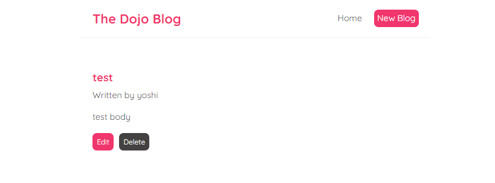
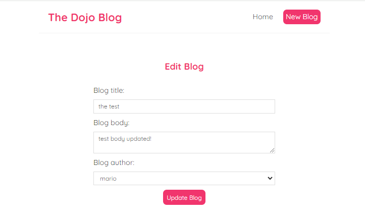

# React Blog App

This project is a simple and interactive blog application built with React. It allows users to view, create, edit, and delete blog posts, providing a smooth and fluid user experience. It demonstrates core React concepts like component-based architecture, state management with `useState`, routing with `react-router-dom`, and fetching data from a server using a custom hook `useFetch`.

## Features

- **View Blogs**: Lists all available blogs fetched from a local JSON server.
- **Blog Details**: View the full details of a specific blog post by clicking on the blog title.
- **Create Blog**: Add a new blog post with a title, body, and author.
- **Edit Blog**: Modify existing blog posts, updating the title, body, and author.
- **Delete Blog**: Delete a blog post from the server.
- **404 Page**: Custom "Not Found" page for unmatched routes.

## Project Structure

### Components

- **App.js**: The root component and the main entry point that defines the routing for the app.
  - Uses `react-router-dom` for page routing.
  - Includes pages like Home, Create Blog, Edit Blog, Blog Details, and Not Found.
  
- **Navbar.js**: The navigation bar component.
  - Contains links to the Home and Create Blog pages.

- **Home.js**: The home page that fetches and displays a list of blogs.
  - Uses a custom `useFetch` hook to retrieve blog data from `http://localhost:8000/blogs`.

- **BlogList.js**: Displays a list of blog previews.
  - Each blog links to the full blog details page.

- **BlogDetails.js**: Displays the details of a selected blog and allows the user to delete it or navigate to the edit page.

- **EditBlog.js**: A form that lets users edit an existing blog post.
  - Fetches the current blog data and allows updates to the title, body, and author.

- **Create.js**: A form that lets users create a new blog.
  - Upon submission, the blog is sent to the server, and the user is redirected to the homepage.

- **NotFound.js**: Displays a custom 404 message for non-existing routes.

### Custom Hook

- **useFetch.js**: A custom hook used for fetching data from an API. It handles loading states, errors, and fetch aborting.

# Routs

- **GET `/`**: Home Page/Content 
- **GET `/create`**: Create Blog Page/Content  
- **GET `/edit/:id`**: Edit Blog Page/Content  
- **GET `/blogs/:id`**: Blog Details Page/Content  
- **GET `*`**: Not Found Page/Content  

# The Dojo BLOG Pages(contents):

## Home
**List of the Posts**

## Blog Details

## Add a New Post

 

## Update / Delete a Post

## Not Found Page
